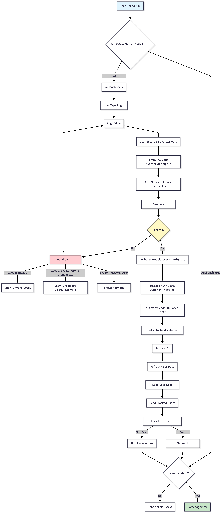
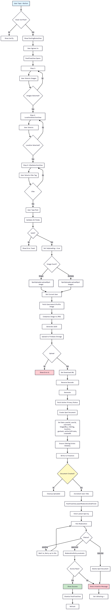
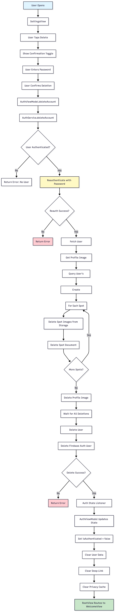
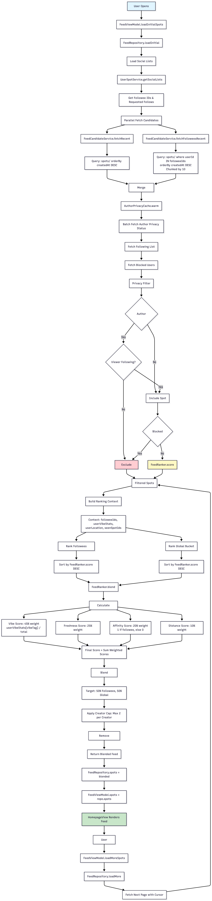
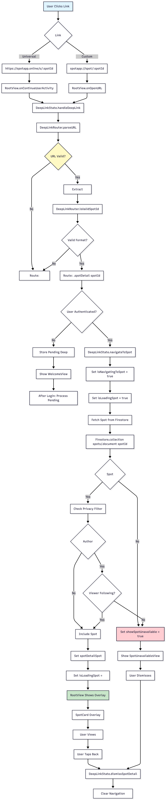
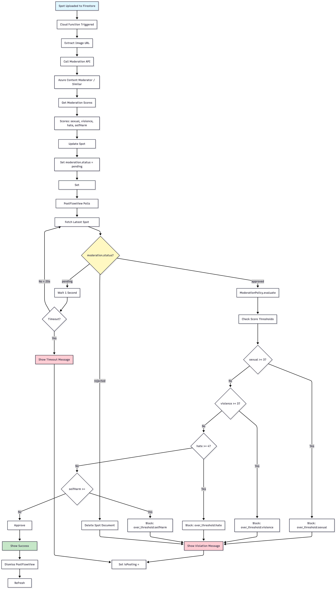

# Spot Architecture Documentation

## Table of Contents
1. [System Overview](#system-overview)
2. [Architecture Patterns](#architecture-patterns)
3. [Core Flows](#core-flows)
   - [Login Flow](#login-flow)
   - [Posting Flow](#posting-flow)
   - [Account Deletion Flow](#account-deletion-flow)
   - [Feed Algorithm Flow](#feed-algorithm-flow)
   - [Deep Linking Flow](#deep-linking-flow)
   - [Moderation Flow](#moderation-flow)
4. [Component Architecture](#component-architecture)
5. [Data Flow](#data-flow)

---

## System Overview

Spot is a location-based social media iOS application built with SwiftUI and Firebase. The app enables users to discover and share "spots" (location-tagged photos with vibe tags) through a personalized feed algorithm.

### Technology Stack
- **Frontend**: SwiftUI (iOS)
- **Backend**: Firebase (Auth, Firestore, Storage)
- **Architecture**: MVVM with Service Layer
- **State Management**: `@Published`, `@StateObject`, `@EnvironmentObject`

### Key Services
- **Firebase Auth**: User authentication and session management
- **Firestore**: NoSQL database for users, spots, and relationships
- **Firebase Storage**: Image storage and CDN
- **CoreLocation**: Location services and geocoding

---

## Architecture Patterns

### MVVM Pattern
- **Views**: SwiftUI declarative UI components
- **ViewModels**: Observable objects managing UI state and business logic
- **Services**: Stateless service classes abstracting Firebase APIs
- **Repositories**: Stateful data management with pagination and caching

### Service Layer
- **AuthService**: Authentication operations
- **SpotService**: Spot CRUD operations
- **FeedRepository**: Feed pagination and ranking
- **SearchService**: Search functionality
- **UserSpotService**: User-spot interactions (likes, bookmarks)

---

## Core Flows

### Login Flow

**Key Components:**
- `LoginView`: UI for email/password input
- `AuthService.signIn()`: Core authentication logic
- `AuthViewModel`: Manages auth state and user data
- `RootView`: Routes based on authentication state

**Error Handling:**
- Maps Firebase error codes to user-friendly messages
- Handles network errors gracefully
- Validates input before submission

---

### Posting Flow

**Key Components:**
- `PostFlowView`: Multi-step wizard UI
- `SpotUploader`: Handles image upload and document creation
- `VibeTagService`: Ensures vibe tags exist globally
- `ModerationPolicy`: Evaluates moderation scores

**Error Handling:**
- Validates all fields before submission
- Cleans up uploaded images on failure
- Handles moderation timeouts gracefully

---

### Account Deletion Flow

**Key Components:**
- `AuthService.deleteAccount()`: Orchestrates deletion
- `DispatchGroup`: Coordinates async deletions
- `Firebase Storage`: Image cleanup
- `Firestore`: Document deletion

**Safety Measures:**
- Requires password reauthentication
- Best-effort cleanup (continues on individual failures)
- Clears all user-related caches

---

### Feed Algorithm Flow

**Ranking Algorithm Details:**

**Scoring Formula:**
\`\`\`
score = (0.45 × vibeScore) + (0.25 × freshnessScore) + 
        (0.20 × affinityScore) + (0.10 × distanceScore)
\`\`\`

**Component Scores:**
- **Vibe Score**: \`userVibeStats[vibeTag] / totalVibeStats\` (0-1)
- **Freshness Score**: \`exp(-ageHours / 72)\` (exponential decay)
- **Affinity Score**: \`1.0\` if followee, else \`0.0\`
- **Distance Score**: \`1.0\` if ≤25km, else \`25km / distanceKm\`

**Blending Strategy:**
- Target ratio: 50% followees, 50% global
- Creator cap: Maximum 2 spots per creator per page
- Deduplication: Removes spots already seen
- Backfill: Fills remaining slots if under target

**Key Components:**
- `FeedRepository`: Manages pagination and cursors
- `FeedCandidateService`: Fetches candidate spots
- `FeedRanker`: Scores and blends spots
- `AuthorPrivacyCache`: Filters private content

---

### Deep Linking Flow

**Key Components:**
- `DeepLinkRouter`: Parses URLs and routes
- `DeepLinkState`: Manages navigation state
- `RootView`: Handles URL events
- `AuthorPrivacyCache`: Filters private content

**Supported URL Formats:**
- Universal: \`https://spotapp.online/s/{spotId}\`
- Custom Scheme: \`spotapp://spot/{spotId}\`
- Query Variant: \`spotapp://open?spotId={spotId}\`

---

### Moderation Flow

**Moderation Thresholds:**
- **Sexual Content**: Block at score ≥ 3
- **Violence**: Block at score ≥ 3
- **Hate Speech**: Block at score ≥ 4
- **Self-Harm**: Block at score ≥ 3

**Key Components:**
- `ModerationPolicy`: Evaluates scores against thresholds
- `PostFlowView.awaitModerationAndFinish()`: Polls for status
- Cloud Function: Processes images and updates documents

---

## Component Architecture

### View Layer
\`\`\`
Views/
├── Auth/
│   ├── LoginView
│   ├── SignupView
│   └── ConfirmEmailView
├── Home/
│   ├── HomepageView
│   └── MapView
├── PostFlow/
│   ├── PostFlowView
│   ├── PhotoSelectionView
│   ├── LocationSelectionView
│   └── VibeSelectionView
├── Profile/
│   └── ProfileView
└── Components/
    └── SpotCard
\`\`\`

### ViewModel Layer
\`\`\`
ViewModels/
├── AuthViewModel (EnvironmentObject)
├── FeedViewModel
├── ProfileViewModel
└── SearchViewModel
\`\`\`

### Service Layer
\`\`\`
Services/
├── Auth/
│   └── AuthService
├── Spots/
│   ├── SpotService
│   └── SpotUploader
├── Feed/
│   ├── FeedRepository
│   ├── FeedRanker
│   └── FeedCandidateService
├── Search/
│   └── SearchService
└── UserSpotService
\`\`\`

### Data Models
\`\`\`
Models/
├── Spot
├── User
├── Place
└── VibeTag
\`\`\`

---

## Data Flow

### Authentication Flow
\`\`\`
LoginView → AuthViewModel → AuthService → Firebase Auth
                                    ↓
                            Firestore (User Document)
                                    ↓
                            AuthViewModel (State Update)
                                    ↓
                            RootView (Route to Home)
\`\`\`

### Posting Flow
\`\`\`
PostFlowView → SpotUploader → Firebase Storage (Images)
                                    ↓
                            Firestore (Spot Document)
                                    ↓
                            Cloud Function (Moderation)
                                    ↓
                            PostFlowView (Poll Status)
                                    ↓
                            FeedRepository (Refresh)
\`\`\`

### Feed Flow
\`\`\`
HomepageView → FeedViewModel → FeedRepository
                                    ↓
                            FeedCandidateService (Fetch)
                                    ↓
                            AuthorPrivacyCache (Filter)
                                    ↓
                            FeedRanker (Score & Blend)
                                    ↓
                            FeedViewModel (Update State)
                                    ↓
                            HomepageView (Render)
\`\`\`

---

## Key Design Decisions

### 1. Privacy Filtering
- **AuthorPrivacyCache**: Actor-based cache for thread-safe privacy checks
- **Denormalization**: \`authorIsPrivate\` stored on spot documents
- **Batch Fetching**: Chunked queries to minimize Firestore reads

### 2. Feed Ranking
- **On-Device Ranking**: Reduces server load, enables real-time personalization
- **Weighted Scoring**: Configurable weights for different signals
- **Creator Diversity**: Caps per-creator spots to prevent feed dominance

### 3. Image Moderation
- **Async Processing**: Non-blocking upload with polling
- **Client-Side Evaluation**: \`ModerationPolicy\` evaluates scores locally
- **Graceful Degradation**: Timeout handling for slow moderation APIs

### 4. State Management
- **Shared Repositories**: \`FeedRepository.shared\` for single source of truth
- **Environment Objects**: \`AuthViewModel\` accessible throughout app
- **Optimistic Updates**: Immediate UI updates with rollback on failure

### 5. Error Handling
- **Structured Logging**: \`SpotLogger\` with consistent format
- **User-Friendly Messages**: Mapped error codes to readable text
- **Retry Logic**: Built into pagination and moderation polling

---

## Performance Optimizations

1. **Privacy Cache**: 5-minute TTL reduces Firestore reads
2. **Batch Queries**: Chunked \`whereField(..., in: [...])\` queries
3. **Image Compression**: JPEG 0.7 quality before upload
4. **Lazy Loading**: \`LazyVStack\` for feed rendering
5. **Pagination**: Cursor-based pagination with \`DocumentSnapshot\`
6. **Deduplication**: Prevents duplicate spots in feed

---

## Security Considerations

1. **Reauthentication**: Required for sensitive operations (delete account)
2. **Privacy Filtering**: Server-side rules + client-side cache
3. **Input Validation**: Username, email, and location validation
4. **Moderation**: Content moderation before public visibility
5. **Firestore Rules**: Server-side security rules for data access

---

## Future Enhancements

1. **Offline Support**: Local caching with sync
2. **Push Notifications**: Real-time updates for interactions
3. **Analytics**: Event tracking and user behavior analysis
4. **A/B Testing**: Feed algorithm experimentation
5. **Advanced Search**: Full-text search with Algolia or similar