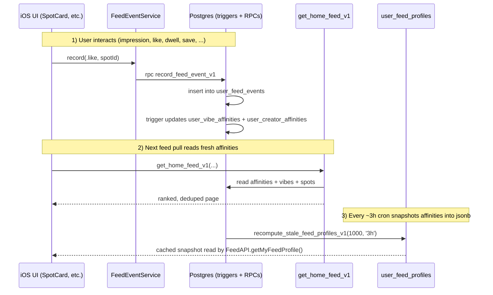

# Personalization Algorithm and Cached Profile

This document explains how Spot personalizes each user's home feed and how the iOS app surfaces that personalization through the **"Your Algorithm"** screen and the **Settings → Debug → Algorithm snapshot** screen. It is written against the current implementation in the codebase and the live Supabase project.

It is intentionally written so a new contributor (or the project owner returning in 6 months) can read this single file end-to-end and understand:

1. How a user's interactions become personalization data.
2. How the home feed actually ranks spots **live** for each request.
3. What the **cached profile snapshot** is, why it exists, and how it differs from the live ranker.
4. How the iOS client reads and refreshes that snapshot, and where it shows up in the UI.
5. How to inspect, debug, and operate the system safely (RLS, cron, manual recomputes).

> Two related docs cover adjacent surfaces:
> - `docs/spot-fetching-system.md` — historical/legacy notes on candidate generation and ranking weights (predates the current Supabase-first v2 pipeline; some weights there are stale, but the high-level mental model still applies).
> - `docs/map-page.md` — map discovery (separate from feed personalization but also reads `public.spots` / `public.users`).

---

## 1) The two layers at a glance

There are **two distinct personalization layers** in Spot, and it is critical not to confuse them.

| Layer | Surface | Lives in | Refreshed | Used by |
| --- | --- | --- | --- | --- |
| **Live ranker** | The actual home feed page you see when you open the app | `public.get_home_feed_v1` (PL/pgSQL) | Computed on **every** RPC call | The home feed pipeline |
| **Cached profile snapshot** | "Your Algorithm" screen + debug JSON | `public.user_feed_profiles` (jsonb row) | Every ~3 hours via `pg_cron`; on-demand from the client | UI display + analytics + debugging |

In other words: **the cached snapshot does not control your feed.** It is a periodically-computed *summary* of the same affinity tables the live ranker reads. The live ranker always reads fresh affinity rows directly. The snapshot exists so the client can:

- Show a beautiful "Your top vibes / favorite creators" surface without making the user wait for an expensive aggregation on every render.
- Power a "For You" badge tooltip eventually (e.g., "you're seeing this because you like Chill Spot").
- Provide a debug surface that's a faithful read of what the system thinks about the user.

Both layers ultimately read from the same underlying signal tables (`user_vibe_affinities`, `user_creator_affinities`, `user_feed_events`, etc.), so the snapshot stays roughly in sync with the live ranker.

---

## 2) Module map

| Layer | File / Object | Role |
| --- | --- | --- |
| **Database — signal tables** | `public.user_feed_events` | Append-only event log: every impression, dwell, like, save, hide, block, unblock, profile_tap, etc. |
|  | `public.user_vibe_affinities` | Per-user × vibe rolling score. Maintained by triggers on `user_feed_events` and `spot_likes` / `spot_bookmarks`. |
|  | `public.user_creator_affinities` | Per-user × creator rolling score. Same maintenance pattern. |
|  | `public.feed_impressions` | Durable "this user has seen this spot N times" record, for dedupe and pagination. |
|  | `public.spot_likes`, `public.spot_bookmarks` | Source of truth for likes and saves. Triggers fan out into `user_feed_events` so the affinity scores include them. |
|  | `public.spots`, `public.users`, `public.vibe_tags` | Content + author + vocabulary. |
| **Database — live feed RPC** | `public.get_home_feed_v1(...)` | Filters, ranks, dedupes, paginates, and records impressions. Returns one page of `HomeFeedRow`. |
|  | `public.get_home_feed_status_v1()` | Diagnostic for empty-feed disambiguation. |
|  | `public.feed_event_weight_v1(text)` | Returns the canonical signed weight for a given event type. Single source of truth for "how much does a like count?". |
| **Database — cached snapshot** | `public.user_feed_profiles` | One row per user. Holds `profile jsonb` + `last_computed_at`. RLS-protected (owner-only select). |
|  | `public.recompute_user_feed_profile_v1(uuid)` | Builds the jsonb snapshot for one user. Privileged (`SECURITY DEFINER`, no client grants). |
|  | `public.recompute_my_feed_profile_v1()` | Self-only wrapper around the above. Granted to `authenticated` so the iOS client can force-refresh its own row. |
|  | `public.recompute_stale_feed_profiles_v1(int, interval)` | Cron driver: pick missing/stale profiles and recompute them. Privileged, runs as `postgres`. |
| **Database — scheduling** | `pg_cron` job `feed-profiles-recompute-3h` | Runs every 3 hours at minute :37, calls `recompute_stale_feed_profiles_v1(1000, '3 hours')`. |
| **iOS — networking** | `Spot/Services/Feed/FeedAPI.swift` | Defines `FeedProfileRow` / `FeedProfile` Codable tree and three methods: `getMyFeedProfile`, `getMyFeedProfileRawData`, `recomputeMyFeedProfile`. |
|  | `Spot/Models/Logs/FeedSupabaseLogs.swift` | Structured log cases for each of the calls above. |
| **iOS — view model** | `Spot/ViewModels/FeedProfileViewModel.swift` | `@MainActor` observable; `loadInitial()` + `recompute()` + `errorMessage`. |
| **iOS — UI** | `Spot/Views/Profile/FeedProfileView.swift` | The friendly **"Your Algorithm"** screen. |
|  | `Spot/Views/Settings/AlgorithmDebugView.swift` | The raw-JSON **Algorithm snapshot** debug screen. |
|  | `Spot/Views/Profile/ProfileView.swift` | Adds the "Your Algorithm" entry into the profile menu (own profile only). |
|  | `Spot/Views/Profile/SettingsView.swift` | Adds the `#if DEBUG` "Debug → Algorithm snapshot" link. |

---

## 3) End-to-end personalization lifecycle

Every personalization signal in Spot follows roughly this lifecycle. Understanding it makes the rest of this document much easier.



### 3.1 Where signals come from

`public.user_feed_events` accumulates rows of the shape `(user_id, event_type, spot_id?, vibe_tag_id?, target_user_id?, created_at, metadata jsonb)`. The set of `event_type` values currently maintained (and their weights) is encapsulated by `feed_event_weight_v1(text)`:

- **Positive signals** (raise affinity): `like` (+3), `save` (+4), `long_dwell` (+0.75), `detail_open` (+0.5), `visible_2s` (+0.05), `share` (+1).
- **Neutral / metadata signals**: `impression` (0), `profile_tap` (0).
- **Negative signals** (lower affinity / hide content): `quick_skip` (-0.25), `hide_post` (-2), `not_interested` (-2), `block` (-10), `unfollow` (-1).

These weights are not hard-coded into the affinity tables — they are computed in PL/pgSQL from `feed_event_weight_v1(event_type)` whenever needed, so changing them is a single migration, not a backfill.

The two affinity tables (`user_vibe_affinities`, `user_creator_affinities`) keep a running **score** per user × dimension, plus `positive_events`, `negative_events`, and `last_event_at`. They are kept up to date by triggers on `user_feed_events`, `spot_likes`, and `spot_bookmarks` so we never have to recompute them in batch.

### 3.2 How the live ranker uses signals

`public.get_home_feed_v1` is the single source of truth for what shows up in the home feed. Each call:

1. **Picks candidates** from `public.spots` based on the viewer's social graph + global pool, excluding blocked authors and posts the viewer has already seen too many times (via `feed_impressions`).
2. **Computes a ranking score** per candidate as a weighted sum:

   ```
   personalized_score
       = w_vibe     · vibe_affinity_score
       + w_creator  · creator_affinity_score
       + w_follow   · is_followed
       + w_freshness · exp(-age_hours / freshness_half_life_hours)
       + w_distance · distance_score(viewer_lat/lng, spot_lat/lng)
   ```

   Default weights live in the SQL function and are mirrored into the snapshot's `ranker_constants` block so the client knows what produced the scores it's looking at:

   - `w_vibe = 0.35`, `w_creator = 0.25`, `w_follow = 0.15`, `w_freshness = 0.15`, `w_distance = 0.10`.
   - When the viewer is "caught up" (no unseen rows), the function falls back to a **seen-fallback** weighting that drops the `follow` term and rebalances: `w_vibe = 0.45`, `w_creator = 0.35`, `w_freshness = 0.10`, `w_distance = 0.10`.

3. **Squashes affinity scores** through a sigmoid so an outlier creator doesn't drown the rest of the feed:

   ```
   normalized = 1 / (1 + exp(-score / affinity_sigmoid_k))
   ```

   `affinity_sigmoid_k = 5.0`, with raw scores clamped to `[-20, 20]` before the sigmoid.

4. **Records impressions** into `public.feed_impressions` (the same `seen_count` / `last_seen_at` columns used for dedupe), then returns the page.

The snapshot we will describe next is just a stored, periodically-refreshed **summary** of these inputs.

---

## 4) The cached profile snapshot

### 4.1 Table

```
public.user_feed_profiles
  user_id           uuid          PRIMARY KEY  → public.users(id)
  profile_version   integer       NOT NULL DEFAULT 1
  profile           jsonb         NOT NULL
  last_computed_at  timestamptz
  created_at        timestamptz   NOT NULL DEFAULT now()
  updated_at        timestamptz   NOT NULL DEFAULT now()
```

One row per user. The interesting payload lives in `profile` (jsonb).

### 4.2 Profile JSONB reference

```jsonc
{
  "version": 1,                          // bump if shape changes
  "computed_at": "2026-04-26T20:53:06Z", // wall-clock when the snapshot was built

  "stats": {                             // simple counts at snapshot time
    "likes_count":  12,                  // distinct spots the user has liked
    "saves_count":  4,                   // distinct spots the user has bookmarked
    "spots_count":  0,                   // spots the user has authored
    "blocks_count": 0,
    "hidden_count": 0,
    "follows_count": 0,
    "followers_count": 0,
    "distinct_vibes_engaged":   12,      // vibes with any positive affinity
    "distinct_creators_engaged": 27      // creators with any positive affinity
  },

  "top_vibes": [                         // ranked by affinity score, desc
    {
      "vibe_tag_id":     "uuid",
      "name":            "Chill Spot",
      "score":           20.0,           // raw affinity score (post-clamp)
      "positive_events": 25,
      "negative_events": 0,
      "total_events":    25,
      "last_event_at":   "..."
    }
    // up to N entries (currently top 12 by score)
  ],

  "top_creators": [                      // ranked by affinity score, desc
    {
      "creator_id":         "uuid",
      "username":           "mock_remi_0041",
      "profile_image_url":  "https://...",
      "is_private":         false,
      "is_pro":             false,
      "score":              7.85,
      "positive_events":    5,
      "negative_events":    0,
      "total_events":       5,
      "last_event_at":      "..."
    }
    // up to N entries (currently top 20 by score)
  ],

  "ranker_constants": {                  // mirrored from get_home_feed_v1
    "affinity_sigmoid_k":          5.0,
    "affinity_clamp":              [-20, 20],
    "weights_personalized":        { "vibe": 0.35, "creator": 0.25, "follow": 0.15, "freshness": 0.15, "distance": 0.10 },
    "weights_seen_fallback":       { "vibe": 0.45, "creator": 0.35, "freshness": 0.10, "distance": 0.10 },
    "freshness_half_life_hours":   72.0,
    "distance_full_score_meters":  25000
  },

  "event_summary_30d": {                 // events in the last 30 days
    "window_days":  30,
    "total":        96,
    "positive_total_strength":  66.7,    // sum of feed_event_weight_v1(event_type) for positive events
    "negative_total_strength":  0,
    "by_type": [
      { "event_type": "impression",  "n": 33, "total_strength":  0     },
      { "event_type": "visible_2s",  "n": 29, "total_strength":  1.45  },
      { "event_type": "long_dwell",  "n": 17, "total_strength":  12.75 },
      { "event_type": "like",        "n": 12, "total_strength":  36    },
      { "event_type": "save",        "n":  4, "total_strength":  16    },
      { "event_type": "detail_open", "n":  1, "total_strength":  0.5   }
    ]
  },

  "event_summary_90d": { /* same shape, 90-day window */ }
}
```

### 4.3 Functions

There are three SQL functions that touch this table.

```
public.recompute_user_feed_profile_v1(p_user_id uuid) returns jsonb
  - SECURITY DEFINER
  - REVOKED from anon + authenticated; only postgres + service_role + cron may call it
  - body: select all signal tables for p_user_id, build the jsonb, upsert into user_feed_profiles, return the jsonb

public.recompute_my_feed_profile_v1() returns jsonb
  - SECURITY DEFINER, runs as postgres
  - GRANTED to authenticated only
  - reads auth.uid(); raises if null; calls recompute_user_feed_profile_v1(auth.uid())
  - this is the function the iOS client uses for the "Recompute now" button

public.recompute_stale_feed_profiles_v1(p_max_users int default 1000,
                                        p_stale_after interval default '3 hours')
  returns table(processed_count bigint, missing_count bigint, stale_count bigint)
  - SECURITY DEFINER
  - REVOKED from anon + authenticated; only postgres + service_role + cron may call it
  - body: pick (p_max_users) users whose user_feed_profiles row is missing
          OR last_computed_at < now() - p_stale_after, and call
          recompute_user_feed_profile_v1 for each.
```

### 4.4 Cron schedule

```sql
select cron.schedule(
    'feed-profiles-recompute-3h',
    '37 */3 * * *',
    $$select public.recompute_stale_feed_profiles_v1(1000, interval '3 hours');$$
);
```

- Runs at minute **37 of every third hour** (00:37, 03:37, 06:37, … UTC).
- Up to **1,000 stale-or-missing rows per run**. With 500 seeded users and per-row work in the millisecond range, a single run finishes in well under a second on the current dataset.
- The schedule was deliberately chosen off the usual 0 / 15 / 30 / 45 minute marks so it doesn't compete with the other cron jobs (`prune_feed_impressions_v1`, `archive_user_feed_events_v1`).

To check what's scheduled:

```sql
select jobname, schedule, command, active
from   cron.job
order  by jobname;
```

To inspect recent runs / errors:

```sql
select jobname, status, return_message, start_time, end_time
from   cron.job_run_details jr
join   cron.job j on j.jobid = jr.jobid
where  j.jobname like 'feed-profiles-%'
order  by start_time desc
limit  20;
```

### 4.5 Security model

`public.user_feed_profiles` is the most privacy-sensitive table in the personalization path: it is essentially a structured summary of how each user behaves on the platform. It is locked down as follows:

- **RLS enabled** on the table.
- A **single SELECT policy** `(select auth.uid()) = user_id` — every other row is invisible to clients.
- `anon` has **no privileges**.
- `authenticated` has **only SELECT** (no INSERT / UPDATE / DELETE / TRUNCATE).
- All writes go through `recompute_user_feed_profile_v1`, which is `SECURITY DEFINER` and runs as `postgres`; the cron driver and the self-only wrapper both go through it.

This means a misbehaving client can never read or modify another user's snapshot, even if it tries to call the underlying RPC with someone else's UUID — the privileged function is not granted to `anon` or `authenticated` at all.

To verify the lock-down:

```sql
-- RLS state
select c.relrowsecurity as rls_enabled
from   pg_class c
join   pg_namespace n on n.oid = c.relnamespace
where  n.nspname = 'public' and c.relname = 'user_feed_profiles';

-- Policies
select polname, polcmd, pg_get_expr(polqual, polrelid) as using_expr
from   pg_policy
where  polrelid = 'public.user_feed_profiles'::regclass;

-- Table-level grants
select grantee, privilege_type
from   information_schema.table_privileges
where  table_schema='public' and table_name='user_feed_profiles'
order  by grantee, privilege_type;

-- Function grants
select p.proname,
       pg_catalog.pg_get_function_identity_arguments(p.oid) as args,
       p.prosecdef as security_definer
from   pg_proc p
where  p.pronamespace = 'public'::regnamespace
  and  p.proname in ('recompute_my_feed_profile_v1',
                     'recompute_user_feed_profile_v1',
                     'recompute_stale_feed_profiles_v1');
```

To smoke-test RLS as a real user:

```sql
begin;
select set_config('request.jwt.claims',
                  jsonb_build_object('sub','<UID>','role','authenticated')::text,
                  true);
set local role authenticated;

select 'self_visible'   as label, count(*) from public.user_feed_profiles where user_id  = '<UID>'
union all
select 'others_blocked' as label, count(*) from public.user_feed_profiles where user_id <> '<UID>';
rollback;
```

Expected: `self_visible = 1`, `others_blocked = 0`.

---

## 5) iOS client integration

### 5.1 Models

`Spot/Services/Feed/FeedAPI.swift` defines the Codable tree mirroring the JSONB shape 1:1:

| Swift type | Wire field | Notes |
| --- | --- | --- |
| `FeedProfileRow` | the table row itself | Wraps the row's `user_id`, `profile_version`, `last_computed_at`, etc. and the embedded `profile`. |
| `FeedProfile` | `profile` (jsonb) | Top-level snapshot. |
| `FeedProfile.Stats` | `profile.stats` | Simple counts. |
| `FeedProfile.TopVibe` | `profile.top_vibes[]` | Identifiable by `vibe_tag_id`. |
| `FeedProfile.TopCreator` | `profile.top_creators[]` | Identifiable by `creator_id`. |
| `FeedProfile.RankerConstants` | `profile.ranker_constants` | Loose `[String: Double]` for weight maps so server tweaks don't break decoding. |
| `FeedProfile.EventSummary` (+ `Bucket`) | `profile.event_summary_30d` / `_90d` | 30/90-day rollups. |

All structs use `decodeIfPresent` with sane defaults (empty arrays / zeros) for forward compatibility.

### 5.2 Methods on `FeedAPI`

```swift
static func getMyFeedProfile() async throws -> FeedProfileRow?
// Reads public.user_feed_profiles via PostgREST. RLS guarantees the
// returned row, if any, belongs to the caller. Returns nil before the
// first cron pass for a brand-new user.

static func getMyFeedProfileRawData() async throws -> Data
// Same query as above, but returns the raw response bytes for the debug
// JSON viewer. Used only by AlgorithmDebugView so we can pretty-print
// the unmodified server payload.

static func recomputeMyFeedProfile() async throws -> FeedProfile
// Calls public.recompute_my_feed_profile_v1() and decodes the returned
// JSONB into a FeedProfile. Forces a fresh snapshot for the caller and
// updates the cached row in user_feed_profiles as a side effect.
```

Each method emits structured logs through `FeedSupabaseLogs.feedProfileFetched / feedProfileFetchFailed / feedProfileRecomputed / feedProfileRecomputeFailed` (`SpotLogger.log`).

### 5.3 ViewModel

`Spot/ViewModels/FeedProfileViewModel.swift` is intentionally tiny:

```swift
@MainActor
final class FeedProfileViewModel: ObservableObject {
    @Published private(set) var row: FeedProfileRow?
    @Published private(set) var isLoading: Bool
    @Published private(set) var isRecomputing: Bool
    @Published var errorMessage: String?

    var profile: FeedProfile? { row?.profile }
    var lastComputedAt: Date? { row?.lastComputedAt ?? row?.profile.computedAt }
    var hasContent: Bool { /* topVibes/topCreators/total > 0 */ }

    func loadInitial(force: Bool = false) async   // get_my_feed_profile (cached)
    func recompute() async                          // recompute_my_feed_profile + reload
}
```

Behavior contract:

- **`loadInitial()`** is idempotent. Calling it again with `force: false` is a no-op once `row` is hydrated, so you can call it from `.task { ... }` without worrying about duplicate fetches.
- **`recompute()`** chains: RPC → re-read row. If the re-read fails, the in-memory row is preserved and the error surfaces via `errorMessage` (so the UI can show a toast without flickering the data).
- Both setters are `@Published` and gated by `@MainActor`, so SwiftUI re-renders happen on the main run loop as expected.

### 5.4 UI surfaces

There are exactly two screens that consume the snapshot.

#### A. Profile menu → "Your Algorithm" (`FeedProfileView`)

This is the user-facing surface. It's only added to the profile menu when viewing your own profile (`userId == nil || userId == authVM.userId`).

Composition (top → bottom):

1. **Top bar** — title "Your Algorithm" + back chevron.
2. **Freshness card** — sparkles icon, "Personalized for you", "Updated X ago" (or "Hasn't been computed yet"), and a circular refresh button on the right that triggers `viewModel.recompute()`. Pull-to-refresh on the scroll view does the same thing.
3. **Top vibes card** — horizontal scroll of dark pills, each pill shows the vibe name and its positive/negative event counts. Limited to top 8.
4. **Creators you love card** — vertical list of avatar + username (with optional "Pro" badge) + score line. Limited to top 5.
5. **Last 30 days card** — 2×2 grid of stat tiles (Likes, Saves, Spots viewed, Long looks) plus a small row with `distinct_vibes` and `distinct_creators` mini-stats.
6. **Explainer footer** — one short paragraph: "Your feed is tuned by what you like, save, dwell on, and skip. We refresh this snapshot every few hours; pull down to recompute it now."

States the view handles explicitly:

- **Initial load** — generic "Loading your algorithm…" placeholder card.
- **Empty profile** (`profile != nil` but no vibes/creators yet, e.g., a brand-new user) — friendly "Your algorithm is waking up" message with a "Recompute now" button.
- **No row yet** (`profile == nil`) — same friendly state via the loading placeholder, until the cron picks them up or they tap recompute.
- **Error** — error card with a "Try again" button that calls `loadInitial(force: true)`.

#### B. Settings → Debug → "Algorithm snapshot" (`AlgorithmDebugView`)

Wrapped in `#if DEBUG`, so it does not ship in App Store builds.

Composition:

1. **Header card** — explains what the table is, shows `profile_version` and a human-formatted `last_computed_at`.
2. **Actions card** — primary "Recompute now" button (calls `recompute_my_feed_profile_v1`, then re-reads the raw row), and a secondary "Copy JSON to clipboard" button.
3. **Raw JSON card** — pretty-printed (`prettyPrinted + sortedKeys`), monospaced, text-selectable, horizontally scrollable for long lines.

The debug view goes through `FeedAPI.getMyFeedProfileRawData()` (not the typed model) so the user sees the **exact** JSON the server stored, not a re-encoded reconstruction.

### 5.5 UI flow diagram

```mermaid
sequenceDiagram
    participant User
    participant Profile as ProfileView
    participant Algo as FeedProfileView
    participant VM as FeedProfileViewModel
    participant API as FeedAPI
    participant DB as Supabase

    User->>Profile: tap "Your Algorithm"
    Profile->>Algo: navigate
    Algo->>VM: .task → loadInitial()
    VM->>API: getMyFeedProfile()
    API->>DB: select * from user_feed_profiles (RLS: own row only)
    DB-->>API: row
    API-->>VM: FeedProfileRow?
    VM-->>Algo: row published; cards render

    User->>Algo: pull-to-refresh
    Algo->>VM: recompute()
    VM->>API: recomputeMyFeedProfile()
    API->>DB: rpc recompute_my_feed_profile_v1()
    DB->>DB: rebuild jsonb, upsert row
    DB-->>API: fresh FeedProfile
    VM->>API: getMyFeedProfile() (re-read)
    API-->>VM: refreshed FeedProfileRow
    VM-->>Algo: row updated; freshness label re-renders
```

---

## 6) Operational guide

### 6.1 Forcing a backfill for everyone

When the JSONB shape changes (bump `profile_version` in the SQL function):

```sql
-- Run a few iterations until processed_count drops to 0.
select * from public.recompute_stale_feed_profiles_v1(1000, interval '0 hours');
select * from public.recompute_stale_feed_profiles_v1(1000, interval '0 hours');
select * from public.recompute_stale_feed_profiles_v1(1000, interval '0 hours');
```

Passing `interval '0 hours'` makes every existing row "stale" so they all get rebuilt, regardless of `last_computed_at`.

### 6.2 Inspecting one user's snapshot directly (admin / debugging)

This is the same query the iOS debug screen issues, but with `service_role` privileges so it bypasses RLS:

```sql
select user_id,
       profile_version,
       last_computed_at,
       jsonb_pretty(profile) as profile
from   public.user_feed_profiles
where  user_id = '<UID>';
```

Or to compute (and persist) one fresh:

```sql
select jsonb_pretty(public.recompute_user_feed_profile_v1('<UID>')) as profile;
```

> **Never** call `recompute_user_feed_profile_v1` from a regular client/anon role — it isn't granted, and that's the point. The self-only wrapper `recompute_my_feed_profile_v1()` is the only client-callable path.

### 6.3 Inspecting cron health

```sql
-- Is the job there and active?
select jobname, schedule, active
from   cron.job
where  jobname = 'feed-profiles-recompute-3h';

-- Recent runs
select status, return_message, start_time, end_time
from   cron.job_run_details
where  command ilike '%recompute_stale_feed_profiles_v1%'
order  by start_time desc
limit  10;
```

### 6.4 Performance characteristics

- A single call to `recompute_user_feed_profile_v1` reads a small, fixed-size set of rows per user (top-N affinities + 30/90-day event rollups + a few count queries). Cost scales with the *user's own* event volume, not with platform size, so it stays cheap as the app grows.
- A cron pass of 1,000 users completes well under a second on the current dataset (501 users, low-thousands of events).
- The cached row is `~5–15 KB` JSONB depending on how many top vibes/creators the user has.
- Client read latency is dominated by the network round-trip; the actual `select` is a primary-key lookup.

### 6.5 What happens when things go wrong

| Failure mode | Visible symptom | Recovery |
| --- | --- | --- |
| Cron job paused or failing | `last_computed_at` ages past its interval | Re-enable the job; or run `recompute_stale_feed_profiles_v1` manually. |
| RLS misconfigured | Client sees other users' data, or sees nothing | Re-apply `feed_v2_user_feed_profiles_rls` migration; verify with the smoke test in §4.5. |
| RPC throws | Client `recompute()` shows error toast, last-known row preserved | Inspect logs (`SpotLogger` tag `FeedSupabase`), check `cron.job_run_details` for hint. |
| User has zero events | `profile.top_vibes`/`top_creators` are `[]` and `event_summary_30d.total = 0` | This is expected. UI shows the friendly empty state. |

### 6.6 Migrations applied for this feature

In the order they were applied:

1. `feed_v2_user_feed_profile_recomputer` — defines `recompute_user_feed_profile_v1` and `recompute_stale_feed_profiles_v1`, revokes from public/anon/authenticated.
2. `feed_v2_user_feed_profile_cron` — schedules `feed-profiles-recompute-3h`.
3. `feed_v2_recompute_my_feed_profile` — adds the self-only wrapper `recompute_my_feed_profile_v1()` and grants execute to `authenticated`.
4. `feed_v2_user_feed_profiles_rls` — enables RLS on `public.user_feed_profiles`, adds the owner-only SELECT policy, and revokes table privileges from `anon` / `authenticated` except for SELECT on `authenticated`.

> Migration 4 was the **closing** of a real security gap: prior to this migration the table inherited the schema's default ALL grants for `anon`/`authenticated`, which would have let any caller read every other user's algorithm snapshot once we started exposing the table to the client. It is included here so future work doesn't regress that grant set.

---

## 7) Tunable knobs

These are the values you might want to change as the product evolves. Each shows up in the JSONB snapshot under `ranker_constants`, so changing them on the server is automatically reflected in any debug surface.

| Knob | Where | Current value | What it controls |
| --- | --- | --- | --- |
| `affinity_sigmoid_k` | `get_home_feed_v1` + `recompute_user_feed_profile_v1` | `5.0` | How sharply the affinity sigmoid saturates. Lower = more separation between strong-affinity rows; higher = flatter. |
| `affinity_clamp` | same | `[-20, 20]` | Hard ceiling/floor on raw affinity scores before the sigmoid. Stops a runaway creator/vibe from dominating. |
| `weights_personalized` | `get_home_feed_v1` | `vibe 0.35 / creator 0.25 / follow 0.15 / freshness 0.15 / distance 0.10` | Live ranker weights when there are unseen rows. |
| `weights_seen_fallback` | `get_home_feed_v1` | `vibe 0.45 / creator 0.35 / freshness 0.10 / distance 0.10` | Live ranker weights when the user is caught up (no `follow` term). |
| `freshness_half_life_hours` | `get_home_feed_v1` | `72.0` | Half-life of the freshness decay term: a 3-day-old spot scores half what a brand-new spot does for freshness. |
| `distance_full_score_meters` | `get_home_feed_v1` | `25_000` | Spots within 25 km of the viewer get a full distance score. |
| Top-vibes / top-creators cardinality | `recompute_user_feed_profile_v1` | 12 / 20 | How many entries make it into the snapshot. The UI shows fewer (8 / 5). |
| Event window | `recompute_user_feed_profile_v1` | 30 d + 90 d | Two snapshot windows; tweak if you want more/less context. |
| Cron cadence | `feed-profiles-recompute-3h` | every 3 h, 1,000/run | How fresh the cached snapshot is by default. |
| `event_type` weights | `feed_event_weight_v1` | see §3.1 | Fundamentally changes what "important" means. |

---

## 8) Glossary

- **Affinity** — A signed score in `[-20, 20]` capturing how much a user "likes" a given vibe or creator. Maintained incrementally by triggers, never recomputed in batch.
- **Live ranker** — `public.get_home_feed_v1`. The thing that actually ranks the home feed every time the user pulls.
- **Cached profile / snapshot** — A row in `public.user_feed_profiles` summarizing the same affinities for fast client display. Refreshed every ~3h.
- **Self-only RPC** — A `SECURITY DEFINER` function that uses `auth.uid()` internally so the client cannot pass a UUID at all (e.g., `recompute_my_feed_profile_v1()`).
- **Stale row** — A `user_feed_profiles` row whose `last_computed_at` is older than the cron's `p_stale_after` interval (default 3 hours), or absent entirely.
- **Personalization vs. fallback weighting** — Two weight vectors live inside the ranker. The "personalized" one is used when the user has unseen rows; the "seen fallback" one is used when they are caught up.

---

## 9) Future work (not implemented in this turn)

- A small **"For You" badge** on `SpotCard` in the home feed, driven by an in-memory cache of `top_vibes` + `top_creators` so we can render a tooltip like "You're seeing this because you like Chill Spot vibes". This requires plumbing a tiny `FeedProfileCache` actor that `HomepageView` warms on appear, and an optional `forYouReason: String?` parameter on `SpotCard`.
- **Negative signals UI** — surface `negative_events` per vibe/creator in the "Your Algorithm" screen (today they're decoded but not shown because the test dataset has no negatives).
- **Per-tag "less of this" affordance** — long-press a vibe pill in the algorithm screen to dampen its score (insert a `not_interested` event with `vibe_tag_id` metadata), then show optimistic feedback in the UI.
- **Streaming recomputes** — for very active users, drop the 3-hour cadence to ~30 minutes by detecting a burst of high-weight events. Today the client can already force this with `recomputeMyFeedProfile()`, but the platform doesn't auto-react.

