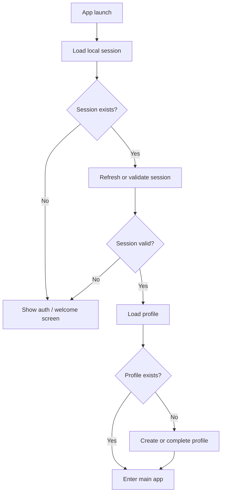

# Diagram: App launch and authentication

## Purpose

Visualize cold start through session validation and main shell.

## Audience

Engineers, reviewers.

## Current status

Conceptual; align with `SpotApp`, `RootView`, and Supabase session APIs.

## Details

## Related docs

- [../engineering/networking-and-auth.md](../engineering/networking-and-auth.md)
- [../product/user-flows.md](../product/user-flows.md)

## Open questions / TODOs

- None.
