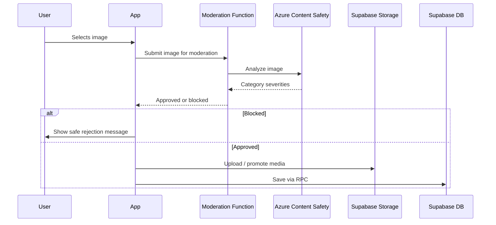

# Diagram: Image moderation sequence

## Purpose

Sequence for moderation-gated uploads.

## Audience

Engineering, safety.

## Current status

Architectural; matches [../engineering/image-moderation.md](../engineering/image-moderation.md).

## Details

## Related docs

- [../engineering/image-moderation.md](../engineering/image-moderation.md)

## Open questions / TODOs

- None.
