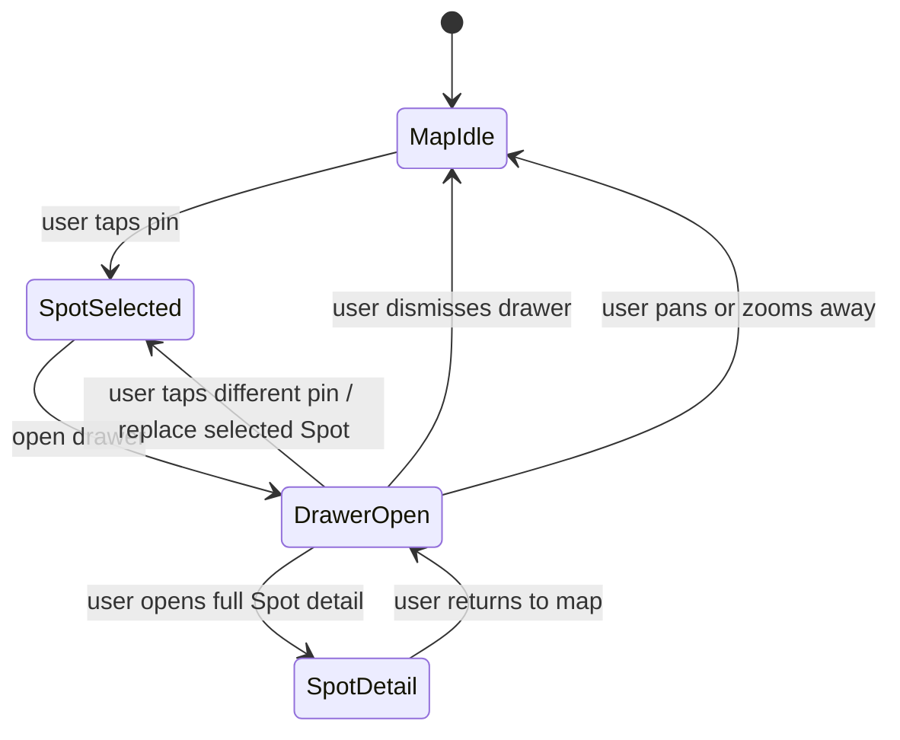

# Diagram: Map spot drawer

## Purpose

State-style view of map selection and drawer.

## Audience

Engineering, QA.

## Current status

Target behavior for map UX; keep aligned with map tests.

## Details

## Related docs

- [../product/map-experience.md](../product/map-experience.md)

## Open questions / TODOs

- Confirm “SpotDetail” transition naming vs actual navigation stack: TODO: verify in Map views.
