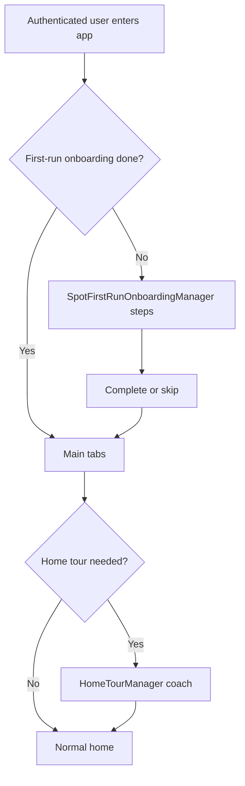

# Diagram: Onboarding

## Purpose

Visualize first-run onboarding relative to the main shell.

## Audience

Product and engineering.

## Current status

High-level; see `HomeTourManager` and `SpotFirstRunOnboardingManager` for exact steps.

## Details

## Related docs

- [../product/onboarding.md](../product/onboarding.md)

## Open questions / TODOs

- Wire exact conditions to UI entry files: TODO: verify in `RootView`.
