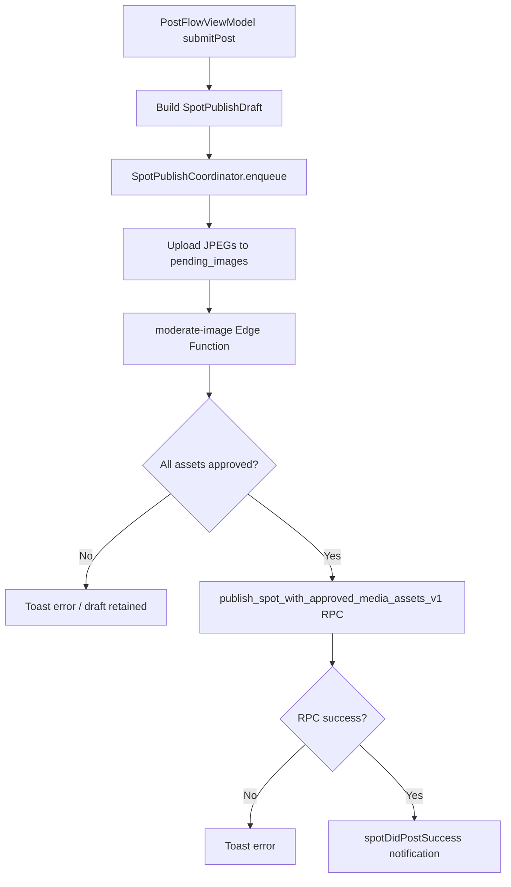

# Diagram: Posting and moderation

## Purpose

End-to-end create Spot through publish on the **Supabase** data plane.

## Audience

Engineering, safety.

## Current status

Matches `SpotPublishCoordinator`, `SpotSupabaseRepository`, and moderation migrations.

## Details

## Related docs

- [../product/posting-flow.md](../product/posting-flow.md)
- [../engineering/data-plane.md](../engineering/data-plane.md)
- [../engineering/image-moderation.md](../engineering/image-moderation.md)

## Open questions / TODOs

- None.
