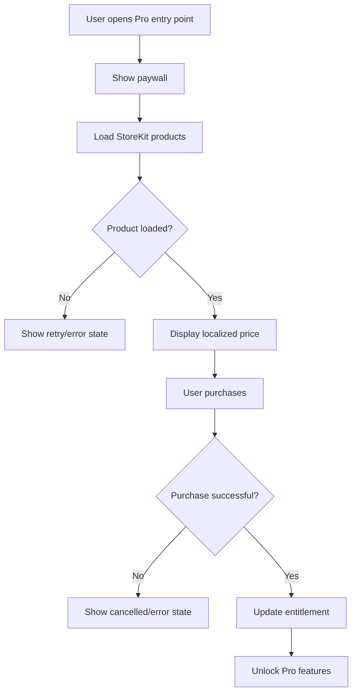

# Diagram: Subscription / Pro

## Purpose

Paywall through entitlement.

## Audience

Product, engineering.

## Current status

Matches `SubscriptionManager` + StoreKit patterns.

## Details

## Related docs

- [../product/pro-subscription.md](../product/pro-subscription.md)

## Open questions / TODOs

- None.
