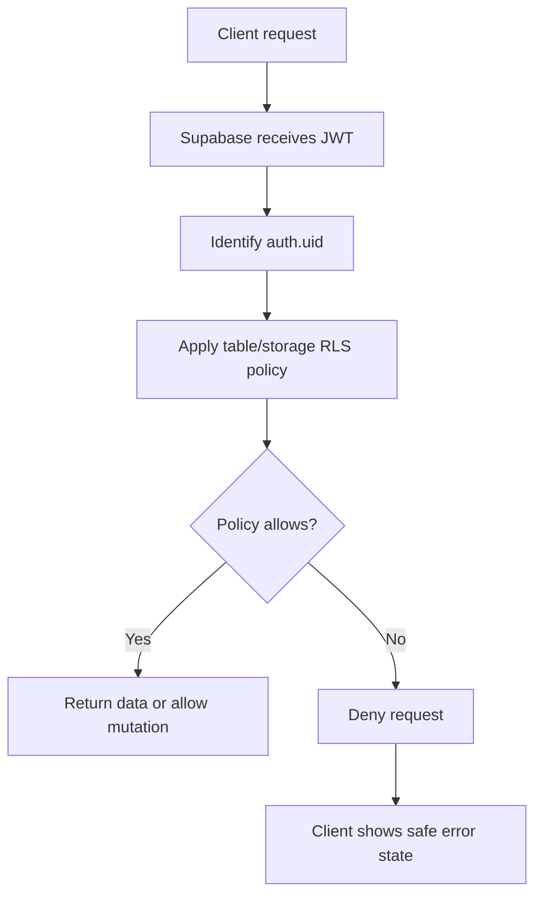

# Diagram: Supabase RLS

## Purpose

Decision flow for RLS enforcement.

## Audience

Security-minded engineers.

## Current status

General Supabase model.

## Details

## Related docs

- [../engineering/database-and-rls.md](../engineering/database-and-rls.md)

## Open questions / TODOs

- None.
