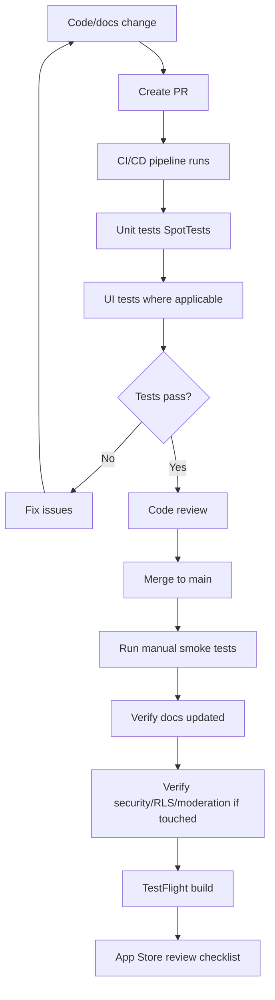

# Diagram: Testing and release

## Purpose

Pipeline from code change to App Store.

## Audience

Engineers and release owners.

## Current status

Recommended team workflow using custom CI/CD pipeline. Xcode Cloud is disabled.

## Details

## Related docs

- [../engineering/ci-cd.md](../engineering/ci-cd.md)
- [../engineering/testing.md](../engineering/testing.md)
- [../engineering/release-process.md](../engineering/release-process.md)

## Open questions / TODOs

- None.
