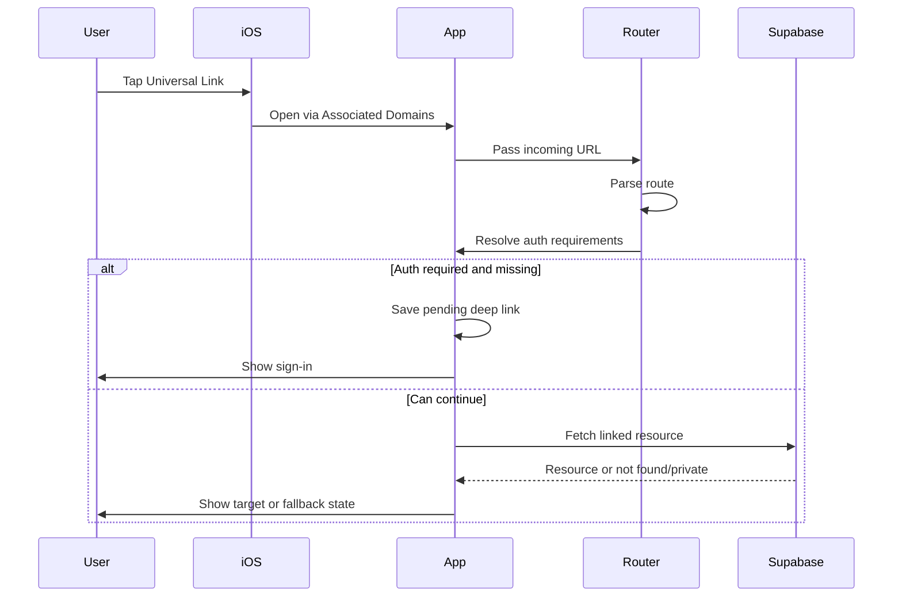

# Diagram: Universal Links

## Purpose

Sequence for opening Spot links.

## Audience

Engineering, support.

## Current status

Matches `DeepLinkRouter` + `DeepLinkState` behavior at a high level.

## Details

## Related docs

- [../engineering/universal-links.md](../engineering/universal-links.md)

## Open questions / TODOs

- None.
