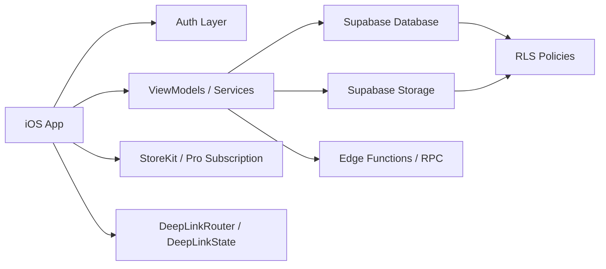

# Architecture

## Purpose

High-level view of the iOS app modules, data flow, and external systems.

## Audience

Engineers and Cursor agents onboarding to the repo.

## Current status

Matches SwiftUI + services layout under `Spot/` and **Supabase as the sole application data plane**; Firebase limited to analytics/crash/app-check (see `docs/engineering/data-plane.md` and `AppDelegate`).

## Details

### High-level architecture

### App directories (concise)

| Path | Role |
| --- | --- |
| `Spot/Views` | SwiftUI screens and components |
| `Spot/ViewModels` | `ObservableObject` state for screens |
| `Spot/Services` | Auth, feed, map, search, spots, subscriptions, analytics |
| `Spot/Services/Supabase` | `SpotSupabaseRepository` and related Postgres/Storage access |
| `Spot/Supabase` | `SupabaseClient` bootstrap from Info.plist |
| `Spot/Models` | Codable models and log enums |
| `Spot/Utils` | Constants, logging, URL config, validators |
| `Spot/Managers` | Cross-feature managers (e.g. onboarding tours) |
| `supabase/migrations` | Schema, RLS, storage, moderation SQL |

### Data flow (typical read)

View → ViewModel → Service/Repository → Supabase client → Postgres/Storage → RLS → decoded models → UI.

### Auth flow

`AuthService` + Supabase Auth session; `SpotAuthBridge` exposes current user id for gates (e.g. deep links). See [networking-and-auth.md](networking-and-auth.md).

### Posting (canonical modules)

| Module | Role |
| --- | --- |
| `PostFlowViewModel` | Composer state; builds `SpotPublishDraft` |
| `SpotPublishCoordinator` | Background publish queue, banners, success/failure notifications |
| `SpotSupabaseRepository` | Storage upload, moderation, `publish_spot_with_approved_media_assets_v1` RPC |

**Do not add** `SpotUploader` or Firestore/Firebase Storage upload paths. See [data-plane.md](data-plane.md).

### Media / storage flow

Pending buckets → moderation → approved buckets; see [storage-and-media.md](storage-and-media.md) and [image-moderation.md](image-moderation.md).

### Universal Links routing

`DeepLinkRouter.parseURL` → `DeepLinkState` navigation and pending link storage when unauthenticated. See [universal-links.md](universal-links.md).

### Logging

`SpotLogger` + per-area `SpotLog` enums; `LoggingConfig` applies DEBUG vs release behavior. See [logging.md](logging.md).

### Testing layout

- `SpotTests` — Swift Testing unit tests.
- `SpotUITests` — XCTest UI tests.
- Test plans: `Spot.xctestplan`, `SpotUITests.xctestplan`.

## Related docs

- [local-setup.md](local-setup.md)
- [supabase.md](supabase.md)
- [testing.md](testing.md)

## Open questions / TODOs

- None blocking for architecture overview.
