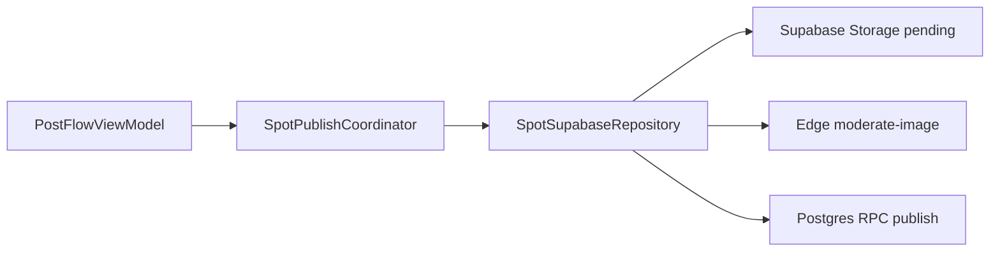

# Application data plane (Supabase only)

## Purpose

Define what backends Spot uses for **user data, spots, media, and social graph** — and what is explicitly forbidden so stale Firebase branches cannot reintroduce the old stack.

## Audience

All engineers, reviewers, Cursor agents, and anyone merging PRs that touch posting, auth, or storage.

## Current status

**Authoritative as of April 2026.** `main` uses **Supabase only** for the application data plane. Firebase is limited to observability SDKs.

## Supabase (required data plane)

| Concern | Implementation |
| --- | --- |
| Authentication | Supabase Auth (`AuthService`, `Spot/Supabase/Supabase.swift`) |
| Users / profiles | `public.users` + RLS |
| Spots | `public.spots`, `public.spot_images`, vibe tags |
| Home feed | RPC `get_home_feed_v1` |
| Publish | `SpotPublishCoordinator` → `SpotSupabaseRepository.publishSpotFromDraft` → moderation + RPC `publish_spot_with_approved_media_assets_v1` |
| Images | Supabase Storage buckets (`pending_images`, `approved_spot_images`, `approved_profile_images`) |
| Social graph | `follows`, `follow_requests`, likes/bookmarks tables + RLS |
| Schema changes | `supabase/migrations/` (apply via reviewed SQL + Supabase MCP in agent workflows) |

### Posting path (canonical)

**There is no `SpotUploader.swift` on `main`.** Do not reintroduce it.

## Firebase (allowed — observability only)

| SDK | Role |
| --- | --- |
| Firebase Analytics | Product analytics (`AnalyticsService`) |
| Firebase Crashlytics | Crash reporting |
| Firebase App Check | Abuse reduction (if enabled for build) |

Firebase must **not** be used for:

- Firestore reads/writes (`FirebaseFirestore`, `Firestore.firestore()`)
- Firebase Storage uploads (`FirebaseStorage`, `Storage.storage()`)
- Firebase Authentication as the session source (`FirebaseAuth` for app login)
- Spot or profile document CRUD

## Forbidden symbols in `Spot/`

`SpotTests/DataPlaneGuardTests` fails CI/local `SpotTests` if production sources under `Spot/` contain legacy data-plane imports or types, including:

- `SpotUploader`, `SpotUploadFirebaseAdapters`, `SpotMultiImageUploadCoordinator` (Firebase-era upload stack)
- `import FirebaseFirestore`, `import FirebaseStorage`, `import FirebaseAuth`, `import FirebaseDatabase`
- `Firestore.firestore()`, `Storage.storage()` (Firebase Storage API)

**Allowed exceptions:** `FirebaseCore`, `FirebaseAnalytics`, `FirebaseCrashlytics`, `FirebaseAppCheck` in `AppDelegate` / analytics files only.

## Obsolete PRs and branches

| Item | Status |
| --- | --- |
| **PR #19** (`copilot/fix-multi-image-upload-error`) | **Do not merge.** Branched before the Supabase migration; reintroduces `SpotUploader` + Firestore two-step writes. Multi-image issues on `main` must be fixed in `SpotPublishCoordinator` / `SpotSupabaseRepository`. |
| **PR #9** (Firestore posting fixes) | Historical; superseded by Supabase publish pipeline. |
| `legacy/firebase/*.rules` | Archived reference only. |

If multi-image posting fails on `main`, debug:

1. `SpotPublishCoordinator.runPublish` / `publishSpotWithTimeout`
2. `SpotSupabaseRepository.publishSpotFromDraft`
3. RLS and `publish_spot_with_approved_media_assets_v1` migration
4. Moderation Edge Function and `pending_images` bucket policies

## PR review checklist (data plane)

- [ ] No new `FirebaseFirestore` / `FirebaseStorage` / `FirebaseAuth` imports under `Spot/`
- [ ] No new `SpotUploader` or Firestore callback upload paths
- [ ] Posting changes go through `SpotPublishCoordinator` or `SpotSupabaseRepository`
- [ ] Schema/RLS changes include `supabase/migrations/` SQL
- [ ] `SpotTests` includes or updates `DataPlaneGuardTests` if allowlist changes

## Related docs

- [architecture.md](architecture.md)
- [supabase.md](supabase.md)
- [storage-and-media.md](storage-and-media.md)
- [image-moderation.md](image-moderation.md)
- [networking-and-auth.md](networking-and-auth.md)
- [../../legacy/firebase/README.md](../../legacy/firebase/README.md)
