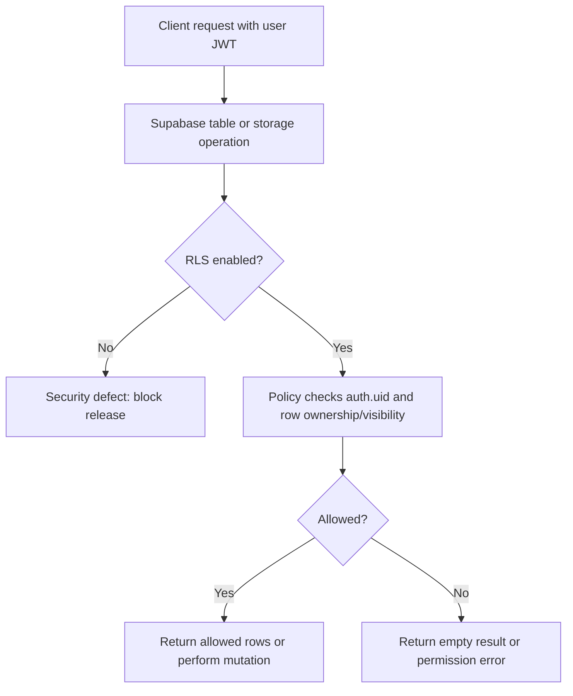

# Database and RLS

## Purpose

Principles for Row Level Security, privacy classes, migrations, and testing expectations.

## Audience

Engineers and DB reviewers.

## Current status

Authoritative policy definitions live in **`supabase/migrations/`**. The app assumes **RLS on** for user data paths.

## Details

### RLS principles

1. **Default deny** — users only read/write rows policies explicitly allow.
2. **Use `auth.uid()`** — tie rows to the authenticated user or visibility rules.
3. **Public reads** — only for data intentionally public (e.g. some spot fields); still validate in SQL.
4. **Mutations** — insert/update/delete must check ownership or role.

### Flow

### Table / policy inventory

**TODO: verify** — generate from live schema or maintain a curated list. Starting references from migrations:

- `media_assets`, `media_moderation_events`
- `users`, `spots` (including `media_display_aspect_ratio`, `media_count`, `media_layout_version` for feed layout), `spot_images` (per-image width/height and clamped display ratio), follow-related tables (see dated migrations)

### Privacy classification (high level)

| Class | Examples | Access |
| --- | --- | --- |
| **Public** | Spot summaries visible on public profiles / map | RLS allows read for eligible viewers |
| **Private** | DMs if any, private profile fields | Owner / relationship-based |
| **System** | Moderation scores, internal IDs | Owner or service role only |

### Migrations

Add dated SQL under `supabase/migrations/`. Never edit applied migration files in production history—add new files to correct behavior.

### Testing RLS

- Use Supabase SQL editor with different `auth.uid()` contexts, or
- Integration tests with test users (**TODO: verify** if repo has automated RLS tests beyond app-level).

## Related docs

- [supabase.md](supabase.md)
- [networking-and-auth.md](networking-and-auth.md)
- [../diagrams/supabase-rls-flow.md](../diagrams/supabase-rls-flow.md)

## Open questions / TODOs

- Maintain machine-readable table inventory: TODO: confirm with owner.
