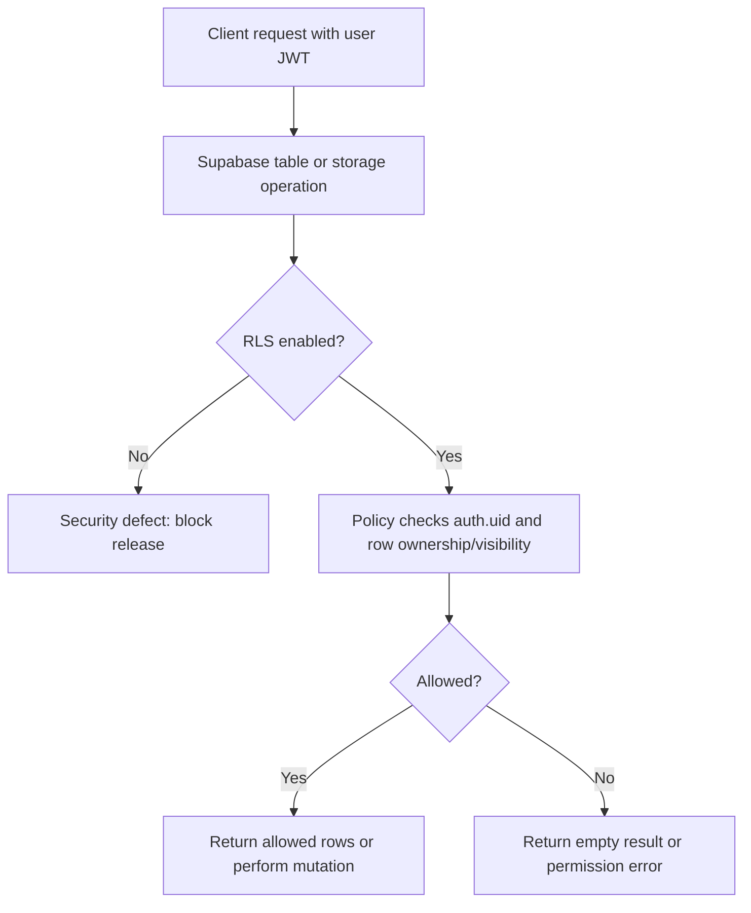

# Database and RLS

## Purpose

Principles for Row Level Security, privacy classes, migrations, and testing expectations.

## Audience

Engineers and DB reviewers.

## Current status

Authoritative policy definitions live in **`supabase/migrations/`**. The app assumes **RLS on** for user data paths.

## Details

### RLS principles

1. **Default deny** — users only read/write rows policies explicitly allow.
2. **Use `auth.uid()`** — tie rows to the authenticated user or visibility rules.
3. **Public reads** — only for data intentionally public (e.g. some spot fields); still validate in SQL.
4. **Mutations** — insert/update/delete must check ownership or role.

### Flow

### Table / policy inventory

**TODO: verify** — generate from live schema or maintain a curated list. Starting references from migrations:

- `media_assets`, `media_moderation_events`
- `users`, `spots` (including `media_display_aspect_ratio`, `media_count`, `media_layout_version` for feed layout), `spot_images` (per-image width/height and clamped display ratio), follow-related tables (see dated migrations)
- `public.follows`: RLS policies `follows_select_related`, `follows_insert_self`, `follows_delete_related` (`20260502120000_security_sweep_rls_part_1.sql`); **unique** `(follower_id, followee_id)` via `follows_follower_followee_uidx` (`20260503120000_follows_unique_follower_followee.sql`)
- `public.reports`: client **insert only** (`reports_insert_own`); columns include `spot_id`, `reporter_id`, `owner_id` (must match `spots.user_id` for `spot_id`), `reason`, `details`, `block_requested`, `platform`, `app_version`, `created_at` (`20260502120000_security_sweep_rls_part_1.sql`, `20260507120000_reports_block_requested_insert_validation.sql`); **after insert** trigger `reports_apply_volume_suspension` sets `users.suspended_for_reports_at` when an author hits report thresholds (see `20260510120000_report_volume_suspension.sql`)
- **Report-volume suspension**: rolling **30 days**, **≥5** reports **and** **≥3 distinct reporters** against the same `owner_id` → `users.suspended_for_reports_at = now()` (idempotent). Effects: `can_view_author` / `users_public` hide them; `get_home_feed_v1` / `get_home_feed_status_v1` exclude their spots (`20260510120000_report_volume_suspension.sql`, `20260510120001_home_feed_rpc_report_suspension.sql`). **Unsuspend (support / SQL editor):** `update public.users set suspended_for_reports_at = null where id = '<uuid>';` — does **not** disable Supabase Auth; it only hides public app surfaces that respect `can_view_*` / feed RPCs.
- `public.users_public`: view rows include self, users you **block** (so Blocked Users settings can resolve `username` / avatar), and existing discoverability rules for unblocked users (`20260502120000_security_sweep_rls_part_1.sql`, `20260508120000_users_public_include_block_list_targets.sql`)
- `public.user_blocks`: authenticated **select/insert/delete** on the table (RLS still applies); insert policy uses `user_blocks_duplicate_exists()` (**SECURITY DEFINER**, `row_security = off`) so duplicate checks do not recurse under FORCE RLS (`20260509120000_users_grants_user_blocks_insert_fix.sql`, `20260509130000_user_blocks_insert_policy_no_rls_recursion.sql`)
- `public.users`: re-assert **select/insert/delete** + column-scoped **update** for `authenticated` so client upsert sync can run (`20260503120000_users_grant_authenticated_table_dml.sql`, `20260509120000_users_grants_user_blocks_insert_fix.sql`)

### Privacy classification (high level)

| Class | Examples | Access |
| --- | --- | --- |
| **Public** | Spot summaries visible on public profiles / map | RLS allows read for eligible viewers |
| **Private** | DMs if any, private profile fields | Owner / relationship-based |
| **System** | Moderation scores, internal IDs | Owner or service role only |

### Migrations

Add dated SQL under `supabase/migrations/`. Never edit applied migration files in production history—add new files to correct behavior.

### Testing RLS

- Use Supabase SQL editor with different `auth.uid()` contexts, or
- Integration tests with test users (**TODO: verify** if repo has automated RLS tests beyond app-level).

## Related docs

- [supabase.md](supabase.md)
- [networking-and-auth.md](networking-and-auth.md)
- [../diagrams/supabase-rls-flow.md](../diagrams/supabase-rls-flow.md)

## Open questions / TODOs

- Maintain machine-readable table inventory: TODO: confirm with owner.
