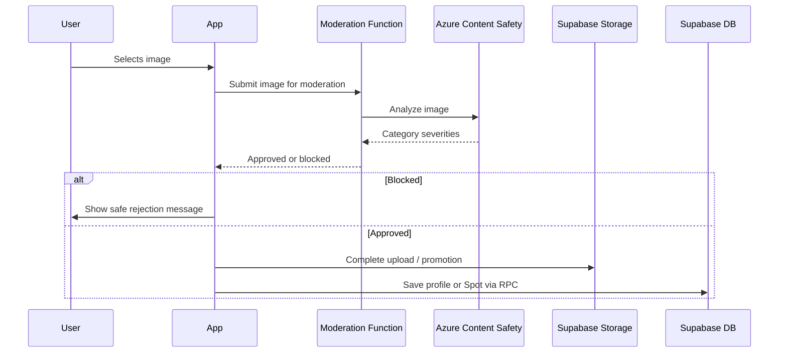

# Image moderation

## Purpose

Requirement and flow: every Spot image and profile image must be moderated before treat-as-approved paths are used.

## Audience

Engineers, safety, review.

## Current status

Postgres migration `20260504100000_image_moderation_azure_v1.sql` defines **`media_assets`**, Azure provider fields, and related policies. Client coordinates with Edge moderation and RPC publish.

## Details

### Requirement

**Every** user-uploaded image for **Spots** or **profile pictures** must go through the moderation pipeline tied to `media_assets`—do not bypass with client-only checks.

### Client responsibilities

- Upload to pending storage only for new moderated assets.
- Poll or await moderation completion per post-flow implementation.
- Show **safe** rejection messages when blocked.

### Server / function responsibilities

- Call **Azure Content Safety** (or configured provider) with server-held credentials.
- Persist scores and outcomes on `media_assets` / `media_moderation_events`.
- Gate final publish on approved status.

### Threshold policy

Category thresholds may live in Edge Function code or SQL—**TODO: verify** in function source (repo path if mirrored, else dashboard).

### Block / allow

- **Blocked** — user sees non-graphic explanation; no public approved path.
- **Allowed** — promote to approved bucket paths and allow RPC completion.

### Logging

Use `SpotLogger` moderation category and repository logs; avoid logging raw image bytes or PII.

### Sequence (target architecture)

## Related docs

- [storage-and-media.md](storage-and-media.md)
- [../diagrams/image-moderation-flow.md](../diagrams/image-moderation-flow.md)
- [environment-variables.md](environment-variables.md)

## Open questions / TODOs

- Exact category thresholds and copy strings: TODO: verify in Edge Function implementation.
