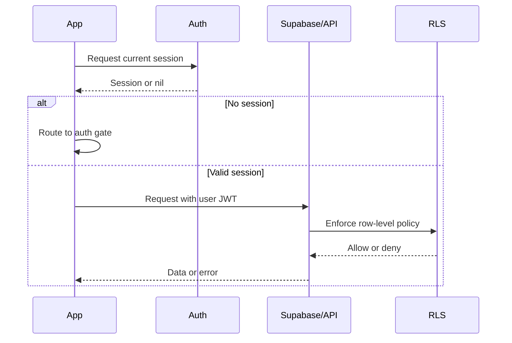

# Networking and authentication

## Purpose

Session expectations, authenticated requests, and security rules for client ↔ Supabase.

## Audience

Engineers and security reviewers.

## Current status

Auth via Supabase (`AuthService`, `Spot/Supabase`). Requests use user JWT from the Supabase client; **RLS** enforces access on the server.

## Details

### Authenticated requests

The Supabase Swift client attaches the current session JWT to Postgres and Storage calls. Treat **401/403** and empty RLS-filtered results as expected when unauthenticated or unauthorized.

### App launch

`RootView` and app entry coordinate session restoration, email confirmation flows, and tab shell vs welcome—see `Spot/Views/RootView.swift` and `SpotApp`.

### Session refresh

Handled by Supabase client session management; **TODO: verify** any custom refresh hooks in `AuthService`.

### Unauthenticated users

- Deep links to Spots may be **stored** in `DeepLinkState.pendingDeepLink` until sign-in (`processPendingDeepLinks()`).
- Posting and mutations must be blocked at UI and still denied by RLS if attempted.

### Security expectations

1. **Never trust client-only checks** for authorization.
2. **RLS** must enforce row and storage access for every sensitive table/bucket.
3. **Posting** requires an authenticated user aligned with `auth.uid()` in policies.
4. **Sensitive data** must not appear in logs in production.

### Sequence (conceptual)

## Related docs

- [database-and-rls.md](database-and-rls.md)
- [../product/user-flows.md](../product/user-flows.md)

## Open questions / TODOs

- Document token lifetime and refresh UX (errors surfaced to user): TODO: verify in `AuthService`.
