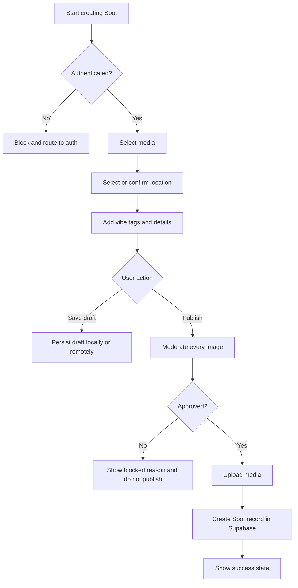

# Posting flow

## Purpose

Describe creating a Spot from the user’s perspective: media, place, vibes, draft, publish, moderation, and failures.

## Audience

Product, engineering, support.

## Current status

Publishing path uses Supabase: pending image upload, Edge Function moderation, RPC `publish_spot_with_approved_media_assets_v1` (see `SpotSupabaseRepository` and `supabase/migrations/20260504100000_image_moderation_azure_v1.sql`).

## Details

### Overview

User opens **Post** tab → multi-step composer (`Spot/Views/PostFlow`) → selects **photos** → **location** / place → **vibe tags** and **details** → **publish** or save work in progress.

### Media

Photos are chosen from the library or camera per system permissions (`Constants.UserDefaultsKeys` track permission prompts).

### Location

User confirms or selects a place (canonical places JSON + search: `LocationSelectionView`).

### Vibe tags and caption

User picks from known tags and adds caption/details as the UI allows.

### Draft behavior

Draft persistence (local vs server): **TODO: verify** in `PostFlowViewModel` and related persistence code.

### Publish and moderation

Every image for Spots must pass **moderation** before being treated as approved media. Client coordinates upload to **pending** storage and server-side moderation; publish completes via RPC when assets are approved.

### Failure states

| Condition | Expected UX (high level) |
| --- | --- |
| Not authenticated | Block publish; route to auth. |
| Upload fails | Error state; user can retry; draft preserved where applicable. |
| Moderation rejects | Safe message; do not publish. |
| Supabase insert / RPC fails | Error; preserve draft where applicable. |
| Network unavailable | Retry / offline messaging per implementation. |

### Flow diagram

## Related docs

- [../engineering/image-moderation.md](../engineering/image-moderation.md)
- [../engineering/storage-and-media.md](../engineering/storage-and-media.md)
- [../diagrams/posting-flow.md](../diagrams/posting-flow.md)

## Open questions / TODOs

- Exact draft storage and recovery UX: TODO: verify in Post flow view models.
