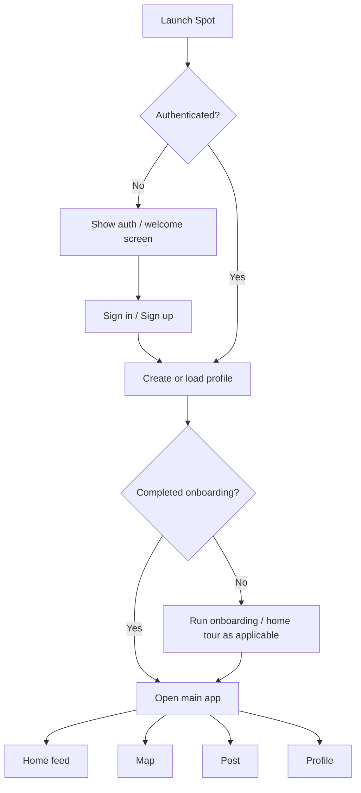

# User flows

## Purpose

Document primary user journeys at a product level with diagrams.

## Audience

Design, product, engineering, QA.

## Current status

High-level flows match `RootView`, auth, tabs, `DeepLinkState`, and onboarding managers in the codebase.

## Details

### Flows covered

- First launch → auth check → onboarding (if applicable) → main tabs.
- Sign in (email flow and Sign in with Apple: see auth views under `Spot/Views/Auth`).
- Onboarding coach (`HomeTourManager`, `SpotFirstRunOnboardingManager`).
- Browse home feed, open Spot detail from feed.
- Map: browse, tap pin, spot drawer, navigate to full detail if offered.
- Create post → publish (with moderation gate).
- Profile, follow, Pro paywall, Universal Link open.

### High-level app flow

### Deep link (Universal Link) user intent

User taps a shared Spot link → iOS opens Spot → router resolves route → Spot detail or unavailable state (see [../diagrams/universal-links-flow.md](../diagrams/universal-links-flow.md)).

## Related docs

- [onboarding.md](onboarding.md)
- [posting-flow.md](posting-flow.md)
- [map-experience.md](map-experience.md)
- [../diagrams/README.md](../diagrams/README.md)
- [../diagrams/app-launch-auth-flow.md](../diagrams/app-launch-auth-flow.md)

## Open questions / TODOs

- Exact “Sign in with Apple only” vs email matrix: TODO: verify against `WelcomeView` / auth policy.
