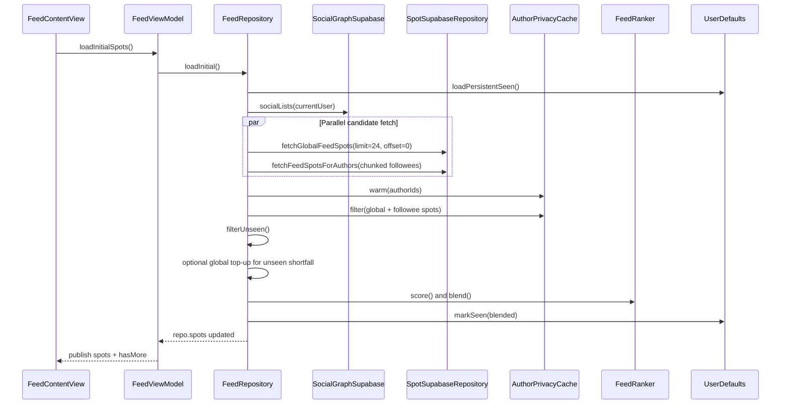
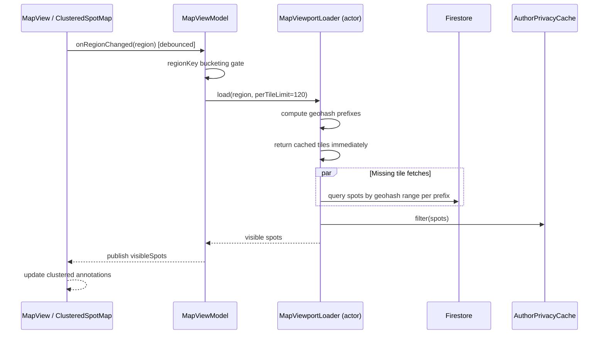
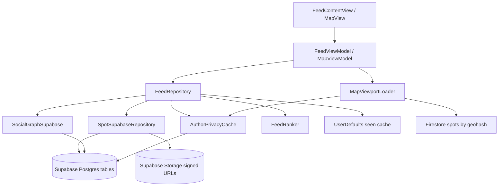

# Spot Fetching System and Ranking Algorithm

This document describes how Spot fetches posts ("spots") for users, how those spots are filtered and ranked, and how map discovery works. It is written against the current implementation in the app codebase.

## 1) High-level system overview

Spot has two main "fetch-to-display" paths:

1. **Home Feed path** (Supabase/Postgres backed):
   - Gathers candidate spots from:
     - followed authors (personal graph)
     - global recent spots
   - Applies privacy/block filtering
   - Applies persistent seen-item deduplication
   - Scores and blends candidates with a weighted ranker
   - Emits a page-sized feed

2. **Map Discovery path** (Firestore geohash tiles backed):
   - Loads visible map tiles based on viewport geohash prefixes
   - Caches tile results in memory
   - Applies privacy/block filtering
   - Renders clustered annotations and supports drill-in

## 2) Home Feed end-to-end flow

### Sequence diagram



### Step-by-step algorithm

#### A. Initialization and state reset

On initial load, repository resets pagination and dedupe state:

- `globalNextOffset = 0`
- `globalExhausted = false`
- `followeeNextOffsetByChunk = [:]`
- `followeeChunkDone = []`
- `followeeMoreAvailable = false`
- in-memory `seenSpotIds = []`

If persistent dedupe is enabled (`FeedFlags.disablePersistentDedupe == false`), it restores seen IDs from `UserDefaults` key `feed.persistentSeen.v1` and drops expired IDs by TTL (`FeedFlags.persistentSeenTTL`, default 7 days).

#### B. Candidate generation

1. Resolve current user ID.
2. Fetch follow graph:
   - `SocialGraphSupabase.socialLists(for:)` -> followed IDs + pending request targets.
   - Feed currently uses **followed IDs** for candidate pool.
3. Fetch in parallel:
   - **Global pool**: `SpotSupabaseRepository.fetchGlobalFeedSpots(limit: 24, offset: globalNextOffset)`
   - **Followee pool**: `fetchFolloweeSpotsMerged(followeeIds:)`

Followee fetch is chunked into groups of 10 authors and queried concurrently. Each chunk tracks its own offset and completion status.

#### C. Privacy and blocking gate

All candidates pass through `AuthorPrivacyCache`:

- refreshes viewer's following list and blocked-user set (TTL-backed)
- warms author privacy for candidate author IDs from `users.is_private`
- filtering rules:
  - keep own spots
  - drop blocked authors
  - keep public authors
  - keep private authors only if viewer follows them
  - drop unknown/unresolved author rows

#### D. Persistent dedupe gate

Candidates are filtered against `seenSpotIds` (session + persisted):

- unseen spots continue
- seen spot IDs are excluded
- this dedupe can be disabled by feature flag

#### E. Global top-up logic

If unseen global items are insufficient to fill the page target:

- repository performs additional global fetch attempts (`maxAttempts = 8`)
- each attempt advances offset and re-applies privacy + unseen filtering
- continues until target reached or source exhausted

There is a second "fallback top-up" mode that can use privacy-approved items even if they are seen (used only when blending returns empty due to strict dedupe).

#### F. Ranking

Each candidate gets a score:

```
score = 0.45*vibe + 0.25*fresh + 0.20*affinity + 0.10*distance
```

Where:

- `vibe`: normalized user preference from `users.vibe_stats`
- `fresh`: exponential time decay `exp(-ageHours / 72)`
- `affinity`: `1.0` if author is followed, else `0.0`
- `distance`:
  - `1.0` if within 25km
  - otherwise `25 / distanceKm` (clamped >= 0)

#### G. Blending and caps

`FeedRanker.blend(...)` applies:

- page target: `FeedFlags.pageSize = 24`
- source mix target:
  - followee target = 12
  - global target = 12
- dedupe key:
  - `id:<spotId>` when ID exists
  - fallback key `u:<userId>#t:<createdAtTimestamp>`
- creator cap:
  - default max 2 posts per creator during main pass
  - relaxed only in final safety backfill if list is underfilled

#### H. Seen-state persistence

Displayed spots are marked seen:

- in-memory set updated immediately
- persisted map `[spotId: timestamp]` written to `UserDefaults`
- old entries are trimmed by TTL during next load

### Load-more pagination behavior

`loadMore()` repeats the same pipeline with ongoing offsets:

- global source continues from `globalNextOffset`
- each followee chunk continues from its own offset
- existing feed IDs are excluded before append
- appended items are marked seen

`moreAvailable` is true while either:

- global is not exhausted, or
- any followee chunk indicates more rows

## 3) Data retrieval details (Supabase)

Feed candidates come from `public.spots` (ordered by `created_at DESC`) and are enriched with:

- author metadata from `public.users` (`username`, `profile_image_url`)
- vibe name from `public.vibe_tags`
- image references from `public.spot_images`

Image URL handling:

- prefers `spot_images.storage_path`
- signs private bucket (`spots`) paths into HTTPS URLs
- supports legacy absolute URLs in `public_url`
- preserves sort order for multi-image spots

## 4) Map discovery system

### Sequence diagram



### Viewport algorithm details

`MapViewportLoader`:

- computes geohash precision from zoom level (`latitudeDelta`)
- uses center prefix + neighbor prefixes for tile coverage
- caches tile results in actor-isolated in-memory dictionary
- fetches missing tiles concurrently from Firestore:
  - `order by geohash`
  - `where geohash >= start && < end`
  - per-tile limit (120 for current caller)
- applies the same `AuthorPrivacyCache` filtering before returning

`MapViewModel`:

- prevents noisy reloads by bucketing region into a discrete `regionKey`
- cancels prior in-flight load when region changes
- fallback behavior:
  - if no spots in current region, expands region by 2.5x
  - caps expanded span at `maxFallbackSpanDelta = 0.45`

`MapView` / coordinator behavior:

- debounces region load by 200ms
- clamps excessive zoom-out and over-distant map center movement
- clusters annotations for performance
- selects spot and opens a detail panel (`SpotCard`)

## 5) Core safeguards and failure behavior

- **Cancellation-safe tasks**: load tasks are canceled on region/view lifecycle changes.
- **Empty feed fallback**: if strict unseen filtering results in no blend, feed falls back to seen (privacy-approved) items.
- **Chunked author queries**: followee requests are chunked to bound query size and improve concurrency.
- **TTL caches**:
  - privacy/follow/block cache TTL: 5 minutes
  - persistent seen-item dedupe TTL: 7 days (default)
- **Diagnostics**: optional feed diagnostics can log exclusion reasons and cold-start seen stats.

## 6) Architecture diagram



## 7) Tunable constants and knobs

- Feed page size: `FeedFlags.pageSize = 24`
- Rank weights: vibe `0.45`, freshness `0.25`, affinity `0.20`, distance `0.10`
- Freshness decay half-life control: `tauHours = 72`
- Near-distance threshold: `25km`
- Creator cap during blend: `2`
- Map debounce: `200ms`
- Map fallback max span: `0.45`
- Map tile cache size: `128` prefixes

## 8) Practical mental model

Think of the feed as a pipeline:

1. **Fetch broad candidates** (follow graph + global)
2. **Enforce access/privacy correctness**
3. **Avoid repeats** (persistent seen)
4. **Rank by relevance**
5. **Blend for diversity and consistency**
6. **Persist impressions** for next session

And think of map discovery as:

1. **Viewport -> geohash tiles**
2. **Cache + parallel tile fills**
3. **Privacy gate**
4. **Cluster and render**

